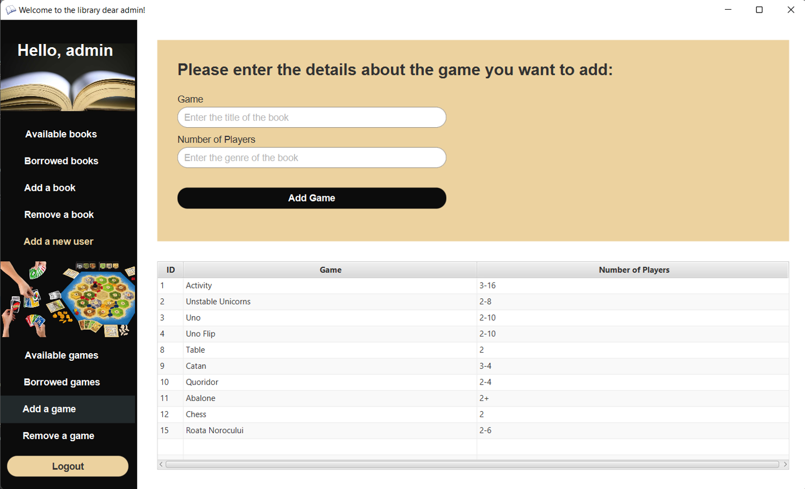
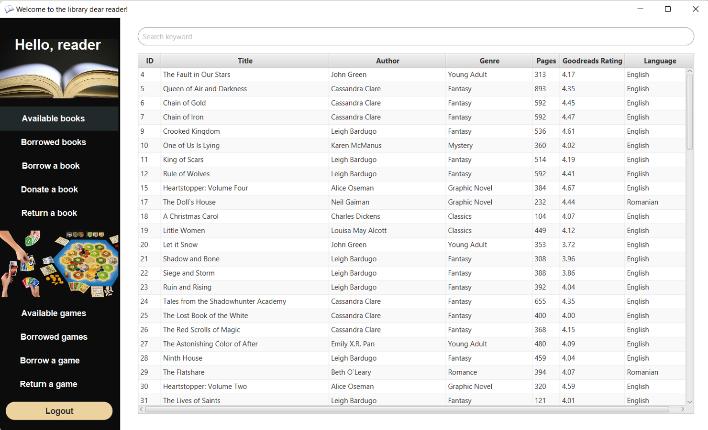
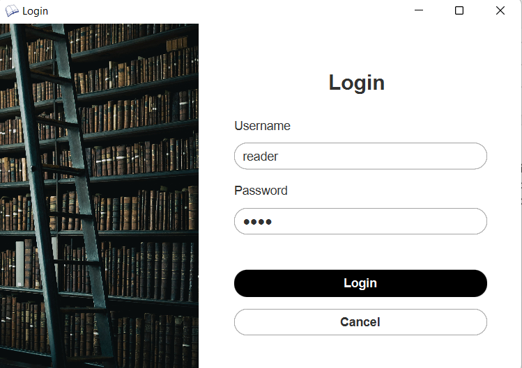

# Books and Board Games Borrowing System

A books and board games borrowing system with a Java backend, a frontend created with JavaFX Scene Builder, and a phpMyAdmin database.

## Admin Interface

The admin has the ability to:
- see all the available books and borrowed books
- add and remove a book or a game
- user management

## Reader Interface

The reader has the ability to:
- see all the available books and borrowed books
- borrow or return a book or a game
- donate a book

## Login Page

The login redirects you to a normal user interface or an admin interface.

